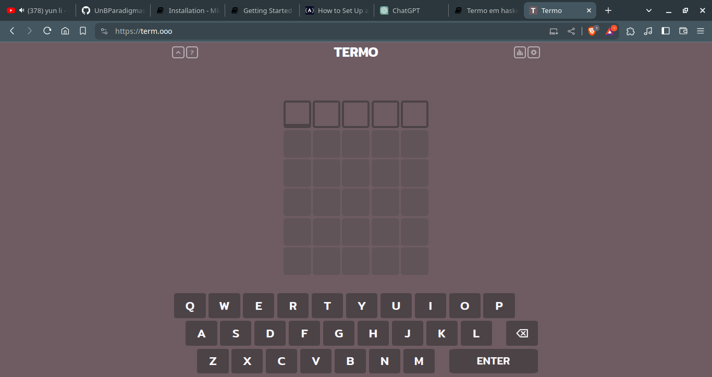
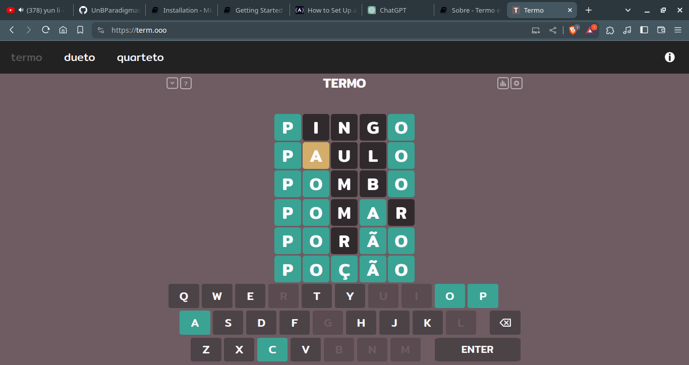

## Sobre 

Termo é uma aplicação no estilo jogo que pretende simular um jogo de advinhação que consiste em que o jogador tente advinhar em no maximo 6 tentativas a palavra escolhida . A palavra tem um tamanho de 5 letras em que para auxiliar o jogador ao tentar advinhar a palavra ele recebe as seguintes instruções:

1-Caso a letra esteja em Verde 🟩 , significa que a letra se encontra na posição correta, 5 letras verdes corresponde ao acerto da palavra

2-Caso a letra esteja em amarelo 🟨,significa que essa letra se encontra nessa palavra porém em outra posição

3-Caso a letra esteja sem nenhuma das cores ,significa que essa letra nao se encontra na palavra

O jogador so obtem vitoria nesse jogo quando acerta as palavras antes de acabar as tentativas .O seguinte projeto tenta similar ao jogo TERMO porém para linguagem huskel .

### Tela inicial do original

### Em funcionamento

### Tela inicial do  projeto

### Projeto em funcionamento

